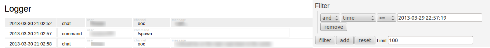

Logolas
=======

Logolas is a simple multi-file log scraper with an accompanying real-time web interface.

Screenshot
----------

Design
------

* Logolas utilizes inotify to watch files for updates. This means it will not work on Windows or over NFS.
* Lines are scraped using regular expressions. At a minimum, each line must include a date/time.
* The scraped lines are persisted to a SQL backend. This addresses loss of historical data due to log rotation. However, currently purging is not automatic.
* Web interface performs standard polling at a configurable rate.

Features
--------

* Multi-file logging
* Multi-regular expression scraping per-file
* Real-time streaming of logged events
* Filtering on any matched field
* Access to historical data (admittedly a bit awkward)

Limitations
-----------
* Cannot parse timezones currently.

Why?
----

An administrator of my Minecraft server needed a web interface that provided real-time access to information stored in multiple log files on my server.

This started as a toy project, but I've decided to publish it as I can imagine there is someone out there who would benefit from this work.
